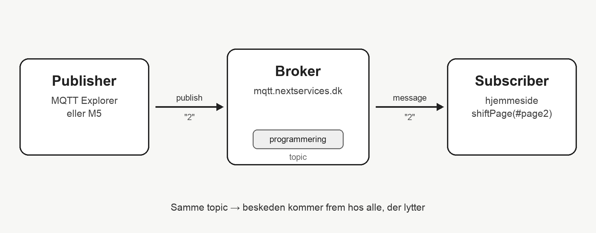

# 11. Favoritspil (2. år)

Sider, menu fra DOM, `shiftPage` — og MQTT, så siden kan styres udefra.

**Demo:** [https://simmoe.github.io/Programmering_B/11_AAR_2_START/](https://simmoe.github.io/Programmering_B/11_AAR_2_START/)  
**Opgave:** [OPGAVE.md](OPGAVE.md)

---

## Sådan virker MQTT

MQTT er beskeder via en **broker**.  
Nogen **publisher** en besked på et **topic**. Alle der **subscriber** på samme topic, modtager den.



I vores eksempel:

- Publisher = MQTT Explorer (senere en M5)
- Broker = `mqtt.nextservices.dk`
- Topic = `programmering`
- Subscriber = hjemmesiden, som kalder `shiftPage`

---

## Menu fra et DOM-array

```js
let allPages = selectAll('.page')

allPages.map(p => {
  let m = createDiv(p.attribute('title'))
  m.mousePressed(() => shiftPage('#' + p.attribute('id')))
  select('footer').child(m)
})
```

HTML-siderne **bliver** menuen. Tilføj en side → menuen følger med.

**Reference:** [p5 selectAll](https://p5js.org/reference/p5/selectAll/) · [p5 createDiv](https://p5js.org/reference/p5/createDiv/)

---

## Skift side med `shiftPage`

```js
function shiftPage(newId) {
  select(currentPage).removeClass('show')
  select(newId).addClass('show')
  currentPage = newId
}
```

CSS-klassen `show` styrer, hvilken side der er synlig.

**Reference:** [p5 addClass](https://p5js.org/reference/p5.Element/addClass/) · [p5 removeClass](https://p5js.org/reference/p5.Element/removeClass/)

---

## MQTT-bibliotek i HTML

```html
<script src="https://unpkg.com/mqtt/dist/mqtt.min.js"></script>
```

Scriptet giver adgang til `mqtt` i JavaScript.

**Reference:** [mqtt.js](https://github.com/mqttjs/MQTT.js)

---

## Forbind til MQTT-broker

```js
client = mqtt.connect('wss://mqtt.nextservices.dk')

client.on('connect', (m) => {
  console.log('Client connected: ', m)
  connectionDiv.html('You are now connected to mqtt.nextservices.dk')
})
```

`wss://` = WebSocket-forbindelse fra browseren til brokeren.

**Reference:** [MQTT.js connect](https://github.com/mqttjs/MQTT.js#mqttconnecturl-options)

---

## Subscribe på et topic

```js
client.subscribe('programmering')
```

Et **topic** er emnet, I lytter på. Kun beskeder på det topic kommer ind.

---

## Modtag beskeder

```js
client.on('message', (topic, message) => {
  console.log('Received Message: ' + message.toString())
  console.log('On Topic: ' + topic)

  connectionDiv.html(
    'Received message: <b>' + message + '</b> on topic: <b>' + topic + '</b>'
  )
})
```

Når nogen **publisher** til topic’et, kører denne funktion.

---

## Skift side via MQTT

```js
let msg = message.toString().trim()
if (!isNaN(msg) && Number(msg) >= 1 && Number(msg) <= allPages.length) {
  shiftPage('#page' + msg)
}
```

Publish `1`, `2` eller `3` på topic `programmering` — så skifter hjemmesiden side.  
Senere kan en M5 i teknikfag sende de samme beskeder.

← [Forrige](../10_AARSPROVE/README.md) · [Pensum](../PENSUM.md) · → [Næste: Personligt API](../12_PERSONLIGT_API/README.md)
